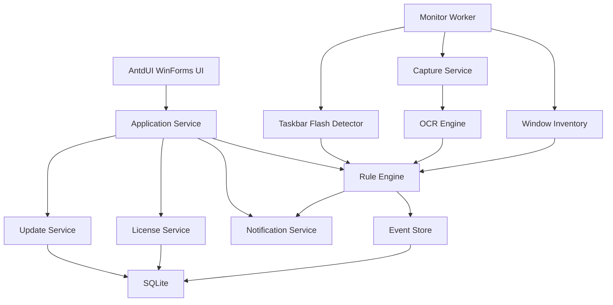
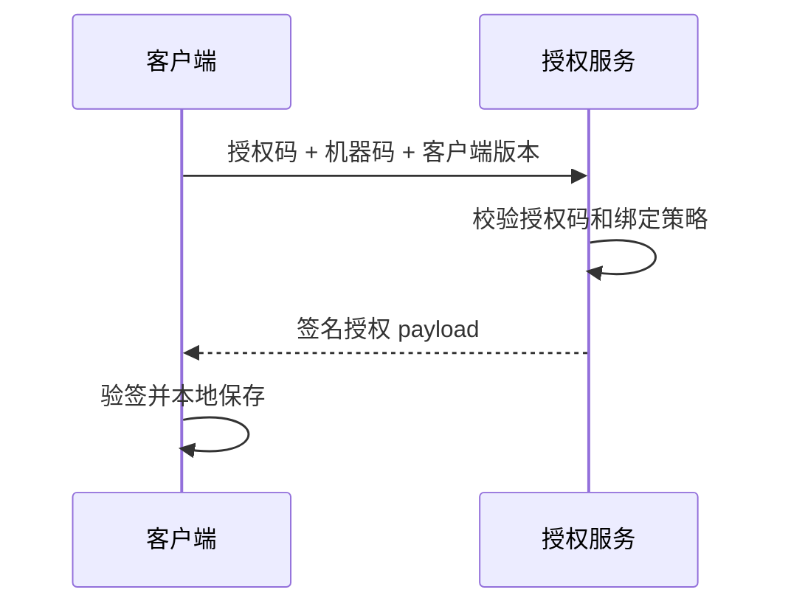
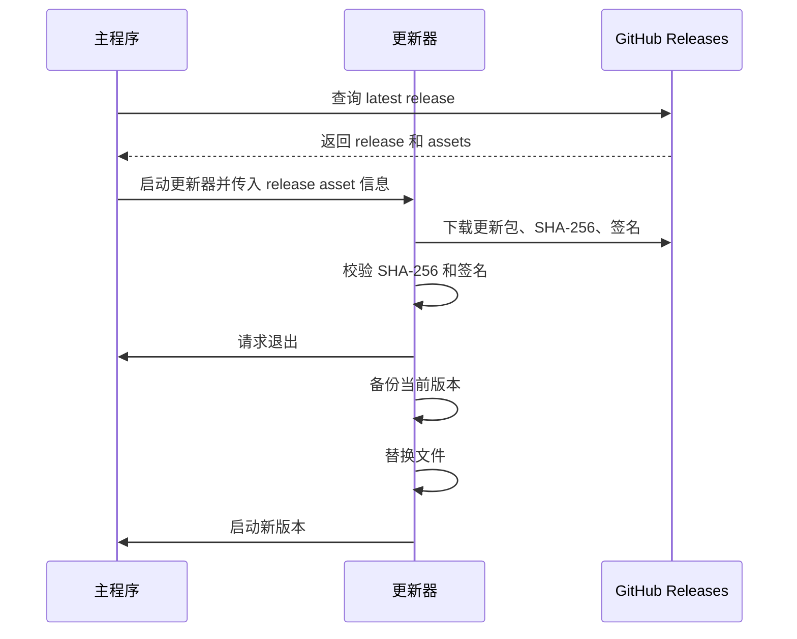

# Windows Monitor 技术设计文档

版本：v0.1  
日期：2026-06-11  
状态：草案

## 1. 技术目标

本软件使用 C# 开发 Windows 桌面客户端，UI 使用 AntdUI。核心能力包括：

1. 枚举并监听所有可见窗口标题。
2. 对桌面、窗口、指定区域进行截图和 OCR 识别。
3. 对窗口标题和 OCR 文本做关键词匹配。
4. 监听指定任务栏软件闪烁或提醒状态。
5. 命中规则后通过本地通知和远程通知渠道发送消息。
6. 支持在线更新。
7. 支持基于本机唯一编码的在线和离线授权。

## 2. 技术栈

| 模块 | 选型 | 说明 |
| --- | --- | --- |
| 语言 | C# | 满足 Windows 原生能力、Win32 API 调用、桌面生态 |
| 运行时 | .NET 8 LTS 或 .NET 10 LTS | MVP 建议 .NET 8 LTS，兼容性更稳；正式立项时再确认目标系统 |
| UI | WinForms + AntdUI | AntdUI 官方文档说明其基于 dotnet WinForms，适合本项目 |
| 本地数据库 | SQLite | 保存规则、事件、日志、授权状态、更新记录 |
| ORM | EF Core 或 Dapper | MVP 可优先 Dapper，减少复杂度 |
| OCR | Windows OCR + 可插拔 OCR 引擎 | 默认中英混合识别；Windows OCR 轻量，后续可接 PaddleOCR/Tesseract |
| 截图 | Win32 API + System.Drawing | 桌面、窗口、区域截图 |
| 通知 | Windows Toast、NotifyIcon、Webhook | 通知渠道可多选，MVP 默认 Windows 通知和 Webhook |
| 更新 | GitHub Releases + 独立 Updater.exe + 签名更新包 | 使用 GitHub Release 托管更新包，客户端校验签名并支持回滚 |
| 授权 | RSA/ECDSA 签名授权文件 + DPAPI 本地存储 | 离线可验签，无需联网 |

参考：

- AntdUI 文档：https://gitee.com/AntdUI/AntdUI/blob/main/doc/wiki/zh/Home.md
- AntdUI NuGet 包：https://www.nuget.org/packages/AntdUI
- GitHub Releases API：https://docs.github.com/v3/repos/releases
- GitHub Release Assets API：https://docs.github.com/en/rest/releases/assets

## 3. 系统架构



### 3.1 进程模型

| 进程 | 说明 |
| --- | --- |
| WindowsMonitor.exe | 主程序，包含 UI、托盘、后台监听 worker |
| WindowsMonitor.Updater.exe | 独立更新器，用于下载、校验、替换文件、回滚 |

MVP 暂不拆 Windows Service，原因：

- 截屏、Toast、托盘、窗口枚举都与当前登录用户会话强相关。
- Windows Service 在 Session 0 中无法稳定访问用户桌面。
- 单进程加托盘后台任务更适合桌面软件。

后续如果需要企业集中部署，可增加后台服务，但 UI 监听仍应运行在用户会话中。

## 4. 项目结构建议

```text
src/
  WindowsMonitor.App/              # WinForms + AntdUI 主程序
  WindowsMonitor.Core/             # 领域模型、规则、事件、授权模型
  WindowsMonitor.Infrastructure/   # SQLite、Win32、OCR、通知、更新实现
  WindowsMonitor.Updater/          # 独立更新器
  WindowsMonitor.Tests/            # 单元测试
docs/
  product-requirements.md
  prototype.html
  technical-design.md
```

核心命名空间：

```text
WindowsMonitor.Core.Rules
WindowsMonitor.Core.Events
WindowsMonitor.Core.Licensing
WindowsMonitor.Infrastructure.Win32
WindowsMonitor.Infrastructure.Ocr
WindowsMonitor.Infrastructure.Capture
WindowsMonitor.Infrastructure.Notifications
WindowsMonitor.Infrastructure.Updates
WindowsMonitor.App.Pages
```

## 5. UI 技术方案

### 5.1 AntdUI 使用方式

AntdUI 文档列出的控件覆盖本项目主要页面需求：

| 页面 | 建议控件 |
| --- | --- |
| 主控台 | PageHeader、Panel、Table、Tag、Progress、Notification |
| 监听规则 | Table、Modal、Drawer、Input、Select、Switch、Checkbox |
| 窗口列表 | Table、Tag、Button、Tooltip |
| 任务栏闪烁 | Table、Select、Switch、Alert |
| 事件日志 | Table、DatePickerRange、Pagination、Modal |
| 授权管理 | Input、UploadDragger、Alert、Steps |
| 在线更新 | Progress、Modal、Timeline、Button |
| 设置 | Tabs、Segmented、Slider、InputNumber |

### 5.2 UI 页面组织

建议主窗体使用左侧导航 + 右侧内容区：

- MainForm：应用主窗口。
- ShellLayout：导航和页面容器。
- DashboardPage：主控台。
- RulesPage：规则列表。
- WindowsPage：窗口列表。
- TaskbarFlashPage：任务栏闪烁监听。
- EventLogsPage：事件日志。
- NotificationSettingsPage：通知渠道。
- LicensePage：授权管理。
- UpdatePage：在线更新。
- SettingsPage：系统设置。

### 5.3 托盘设计

使用 `NotifyIcon`：

- 左键：显示或隐藏主窗口。
- 右键菜单：开始监听、暂停监听、最近提醒、设置、退出。
- 监听异常时托盘图标显示警告状态。

## 6. 窗口监听方案

### 6.1 窗口枚举

使用 Win32 API：

- `EnumWindows`
- `IsWindowVisible`
- `GetWindowTextW`
- `GetClassNameW`
- `GetWindowThreadProcessId`
- `GetWindowRect`
- `DwmGetWindowAttribute`

过滤规则：

- 排除不可见窗口。
- 排除空标题窗口，除非规则指定进程需要 OCR。
- 排除系统窗口、桌面窗口、任务栏窗口。
- 排除用户配置的进程黑名单。

窗口模型：

```csharp
public sealed record WindowSnapshot(
    IntPtr Handle,
    string Title,
    string ClassName,
    int ProcessId,
    string ProcessName,
    Rectangle Bounds,
    bool IsVisible,
    DateTimeOffset CapturedAt
);
```

### 6.2 标题监听

标题监听建议高频低成本轮询：

- 默认间隔：1 秒。
- 每次扫描只处理标题变化或新窗口。
- 命中后进入规则冷却。

标题监听不依赖 OCR，因此 OCR 异常不影响标题监听。

## 7. 截图与 OCR 方案

### 7.1 截图范围

| 范围 | 实现方式 | 注意事项 |
| --- | --- | --- |
| 全桌面 | `Graphics.CopyFromScreen` | 支持多显示器，需要处理虚拟屏幕坐标 |
| 指定区域 | `Graphics.CopyFromScreen` + 用户框选区域 | 注意 DPI 缩放 |
| 普通窗口 | `PrintWindow` 或屏幕区域截图 | 被遮挡窗口优先尝试 `PrintWindow` |
| 最小化窗口 | 通常无法可靠 OCR | 记录为不可截图，仅标题监听 |
| UWP/硬件加速窗口 | 可能黑屏或空白 | 失败后降级屏幕区域截图 |

窗口截图优先级：

1. `PrintWindow(hwnd, hdc, PW_RENDERFULLCONTENT)`。
2. `DwmGetWindowAttribute` 获取扩展边框后屏幕区域截图。
3. 失败则标记 `CaptureFailed`，本轮跳过 OCR。

### 7.2 OCR 引擎接口

```csharp
public interface IOcrEngine
{
    string Name { get; }
    Task<OcrResult> RecognizeAsync(Bitmap image, OcrOptions options, CancellationToken cancellationToken);
}

public sealed record OcrResult(
    string Text,
    IReadOnlyList<OcrWord> Words,
    decimal Confidence,
    TimeSpan Duration
);
```

MVP 引擎：

- `WindowsOcrEngine`：使用 Windows OCR，默认中英混合识别，依赖系统中文和英文语言包。

可选引擎：

- `PaddleOcrEngine`：中文识别效果更好，但包体和部署复杂度更高。
- `TesseractOcrEngine`：离线部署成熟，但中文效果需要模型调优。

建议：

- MVP 先实现 `IOcrEngine` 接口和 Windows OCR。
- OCR 识别语言默认中英文混合，设置页展示中文和英文语言包检测结果。
- 后续按真实测试效果决定是否加入 PaddleOCR。

### 7.3 OCR 调度

OCR 是高成本操作，需要限流：

- 默认 OCR 间隔：5 秒。
- 最大并发：CPU 核心数的一半，最小 1。
- 图片 hash 未变化时跳过 OCR。
- 用户正在全屏游戏或视频时可自动降低频率。
- 单窗口 OCR 超时默认 2 秒。

推荐使用 `System.Threading.Channels`：

```text
WindowInventory -> CaptureQueue -> OcrQueue -> MatchQueue -> EventQueue
```

每个阶段独立限流，避免 OCR 卡住 UI。

### 7.4 OCR 预处理

可选预处理：

- 按 DPI 统一缩放。
- 灰度化。
- 对小字号区域放大 1.5 到 2 倍。
- 去除透明边框。
- 截图尺寸超过阈值时分块 OCR。

MVP 可只做缩放和分块，避免过度调参。

## 8. 规则引擎

### 8.1 匹配输入

规则引擎接收三类输入：

```csharp
public enum MonitorInputType
{
    WindowTitle,
    OcrText,
    TaskbarFlash
}
```

输入模型：

```csharp
public sealed record MonitorInput(
    MonitorInputType Type,
    string Text,
    WindowSnapshot? Window,
    string? ProcessName,
    DateTimeOffset OccurredAt,
    string? EvidencePath
);
```

### 8.2 规则匹配

支持：

- 包含匹配。
- 正则匹配。
- 大小写敏感。
- 全词匹配。
- 任一关键词命中。
- 全部关键词命中。

正则规则需要做保护：

- 编译超时。
- 保存前校验。
- 匹配超时。

### 8.3 去重和冷却

事件指纹：

```text
RuleId + InputType + ProcessName + WindowTitle + Keyword + NormalizedTextHash
```

冷却策略：

- 默认 60 秒。
- 冷却期间同指纹事件记为 `CooldownSkipped`。
- 不同关键词或不同窗口可独立提醒。

## 9. 任务栏闪烁监听方案

### 9.1 现实限制

Windows 没有提供一个稳定公开 API 可以直接查询“某个其他进程的任务栏按钮是否正在闪烁”。`FlashWindowEx` 是应用请求自己窗口闪烁的 API，但系统没有配套的跨进程通用查询函数。

因此该需求需要通过兼容策略实现，并在目标软件上做 POC 验证。

### 9.2 MVP 探测策略

目标选择：

- 用户从当前运行的软件列表中选择监听目标。
- 软件列表来自窗口枚举结果和进程列表，展示进程名、窗口标题、图标、进程路径。
- 保存配置时优先保存进程名和可选窗口标题过滤条件，软件重启后自动恢复监听。

优先级：

1. `SetWinEventHook` 监听系统提醒和对象状态变化。
2. 通过 UI Automation / IAccessible 读取 Explorer 任务栏按钮可访问性状态。
3. 根据目标进程窗口前后台状态、标题变化、通知窗口出现做辅助判断。

建议 Hook 事件：

- `EVENT_SYSTEM_ALERT`
- `EVENT_OBJECT_STATECHANGE`
- `EVENT_OBJECT_SHOW`
- `EVENT_OBJECT_FOCUS`

UI Automation 范围：

- 查找 `Shell_TrayWnd`。
- 查找任务栏按钮容器。
- 根据进程名、窗口标题、AutomationId、Name 匹配目标按钮。
- 检查可访问性状态是否出现提醒、高亮、闪烁相关状态。

### 9.3 闪烁检测接口

```csharp
public interface ITaskbarFlashDetector
{
    IAsyncEnumerable<TaskbarFlashEvent> WatchAsync(
        IReadOnlyList<TaskbarFlashTarget> targets,
        CancellationToken cancellationToken);
}
```

事件模型：

```csharp
public sealed record TaskbarFlashEvent(
    string ProcessName,
    string? WindowTitle,
    IntPtr? WindowHandle,
    TaskbarFlashConfidence Confidence,
    DateTimeOffset OccurredAt,
    string DetectionMethod
);
```

置信度：

- High：WinEvent 明确捕捉到目标相关提醒事件。
- Medium：UI Automation 发现任务栏按钮提醒状态。
- Low：辅助信号推断，需要用户确认。

### 9.4 POC 验证清单

任务栏闪烁目标不预置固定名单，用户可选择任意运行软件。以下软件作为兼容性样例测试对象：

| 软件样例 | WinEvent | UI Automation | 结论 |
| --- | --- | --- | --- |
| 微信 | 待验证 | 待验证 | 需要实测 |
| QQ | 待验证 | 待验证 | 需要实测 |
| 企业微信 | 待验证 | 待验证 | 需要实测 |
| 钉钉 | 待验证 | 待验证 | 需要实测 |
| 浏览器 PWA | 待验证 | 待验证 | 需要实测 |

验收建议：

- 对目标软件逐个记录能否准确触发。
- 每个目标至少测试 10 次闪烁。
- 误报率和漏报率都需要记录。
- 对用户从运行软件列表中选择的目标，关闭并重启软件后仍能自动恢复监听。

## 10. 通知方案

### 10.1 本地通知

MVP 支持的通知渠道：

- Windows Toast 通知。
- AntdUI `Notification` 作为应用内提醒。
- Webhook。

规则维度支持多选通知渠道。默认新建规则勾选 Windows Toast，Webhook 在用户配置地址后可勾选。

Toast 注意事项：

- Win32 桌面应用需要配置 AppUserModelID。
- 需要创建开始菜单快捷方式才能稳定显示 Toast。
- 用户关闭系统通知时降级为托盘气泡。

### 10.2 Webhook 通知

Webhook 请求：

```json
{
  "eventId": "guid",
  "ruleName": "订单异常",
  "hitType": "OcrText",
  "keyword": "超时",
  "windowTitle": "业务系统 - Chrome",
  "processName": "chrome.exe",
  "snippet": "订单处理超时 15 分钟",
  "occurredAt": "2026-06-11T10:42:18+08:00"
}
```

可靠性：

- HTTP 超时默认 5 秒。
- 失败重试 3 次。
- 重试仍失败写入日志。
- 不在通知中默认发送截图。
- Webhook 与 Windows Toast 可同时发送，发送结果分别记录。

## 11. 授权设计

### 11.1 机器唯一编码

机器码生成输入建议：

- Windows `MachineGuid`。
- 主板序列号。
- BIOS 序列号。
- SMBIOS UUID。
- 系统盘卷序列号。

生成流程：

```text
采集硬件标识 -> 标准化 -> 去空值 -> 排序 -> SHA-256 -> Base32/分段展示
```

注意：

- 不保存原始硬件标识，只保存 hash。
- 不使用用户名、电脑名、IP、MAC 作为核心依据，避免隐私和变动问题。
- 允许服务端生成授权时包含多个设备 hash 或硬件变更容忍策略。

### 11.2 离线授权文件

授权文件格式：

```json
{
  "payload": {
    "licenseId": "LIC-20260611-0001",
    "product": "WindowsMonitor",
    "edition": "Professional",
    "licenseType": "monthly",
    "deviceHash": "WM-6F92-5D41-C3A8-9B77-0A12-4C35",
    "features": ["ocr", "taskbar_flash", "webhook"],
    "issuedAt": "2026-06-11T00:00:00+08:00",
    "expiresAt": "2027-06-11T23:59:59+08:00"
  },
  "signature": "base64-signature"
}
```

授权周期：

- `daily`：按天授权。
- `monthly`：按月授权。
- `yearly`：按年授权。
- `permanent`：永久授权，`expiresAt` 可为空。

验签方案：

- 服务端持有私钥。
- 客户端内置公钥。
- 客户端离线读取授权文件并校验签名。
- 校验通过后比对本机机器码。
- 授权状态使用 DPAPI 加密保存到本地。

推荐算法：

- `ECDsa` P-256 或 `RSA` 2048/3072。
- 签名前对 payload 做 canonical JSON。

### 11.3 在线授权

在线授权流程：



在线授权返回的本质仍是签名授权 payload，因此断网后仍可继续运行。

## 12. 在线更新设计

### 12.1 GitHub Releases 更新源

在线更新包使用 GitHub Releases 托管。客户端默认检查 stable release，不安装 prerelease；如果用户在设置中选择测试通道，才允许检查 prerelease。

客户端请求：

```http
GET https://api.github.com/repos/{owner}/{repo}/releases/latest
```

Release assets 建议包含：

| 文件 | 说明 |
| --- | --- |
| `WindowsMonitor-v0.1.1-full.zip` | 完整更新包 |
| `WindowsMonitor-v0.1.1-full.zip.sha256` | 更新包 SHA-256 |
| `WindowsMonitor-v0.1.1-full.zip.sig` | 更新包签名 |
| `WindowsMonitor-v0.1.1-manifest.json` | 可选扩展清单，包含最低支持版本、强制更新策略、发布说明 |

客户端读取 GitHub Release 返回的 `tag_name`、`name`、`body`、`published_at`、`prerelease`、`assets`，并从 asset 的下载地址下载更新包和校验文件。

可选 manifest：

```json
{
  "version": "0.1.1",
  "minSupportedVersion": "0.1.0",
  "channel": "stable",
  "package": "WindowsMonitor-v0.1.1-full.zip",
  "sha256File": "WindowsMonitor-v0.1.1-full.zip.sha256",
  "signatureFile": "WindowsMonitor-v0.1.1-full.zip.sig",
  "notes": "修复 OCR 调度问题"
}
```

私有仓库说明：

- 如果 GitHub Releases 仓库是公开仓库，客户端可匿名检查和下载。
- 如果是私有仓库，需要配置 GitHub token 或通过自有代理服务转发下载，避免 token 暴露在客户端中。

### 12.2 更新流程



失败处理：

- 下载失败：保留当前版本。
- 校验失败：删除更新包并提示风险。
- 替换失败：回滚备份。
- 新版本启动失败：下次启动提示回滚。

### 12.3 更新包安全

- GitHub API 和 asset 下载必须使用 HTTPS。
- 更新包需要 SHA-256。
- manifest 或 package 需要签名。
- 客户端内置更新公钥。
- 更新器本身不允许被在线包静默替换，除非采用双签名策略。
- 不把 GitHub 私有仓库 token 硬编码到客户端。

## 13. 本地数据设计

### 13.1 表结构

```sql
CREATE TABLE MonitorRules (
  Id TEXT PRIMARY KEY,
  Name TEXT NOT NULL,
  Enabled INTEGER NOT NULL,
  ScopeType TEXT NOT NULL,
  ProcessName TEXT NULL,
  WindowTitlePattern TEXT NULL,
  ContentTypes TEXT NOT NULL,
  KeywordsJson TEXT NOT NULL,
  MatchMode TEXT NOT NULL,
  CaseSensitive INTEGER NOT NULL,
  OcrConfidence REAL NOT NULL,
  CooldownSeconds INTEGER NOT NULL,
  NotificationChannelsJson TEXT NOT NULL,
  CreatedAt TEXT NOT NULL,
  UpdatedAt TEXT NOT NULL
);

CREATE TABLE MonitorEvents (
  Id TEXT PRIMARY KEY,
  RuleId TEXT NULL,
  HitType TEXT NOT NULL,
  Keyword TEXT NULL,
  WindowTitle TEXT NULL,
  ProcessName TEXT NULL,
  TextSnippet TEXT NULL,
  EvidencePath TEXT NULL,
  NotificationStatus TEXT NOT NULL,
  OccurredAt TEXT NOT NULL
);

CREATE TABLE AppSettings (
  Key TEXT PRIMARY KEY,
  Value TEXT NOT NULL,
  UpdatedAt TEXT NOT NULL
);

CREATE TABLE LicenseState (
  Id TEXT PRIMARY KEY,
  LicenseId TEXT NOT NULL,
  DeviceHash TEXT NOT NULL,
  Edition TEXT NOT NULL,
  FeaturesJson TEXT NOT NULL,
  ExpiresAt TEXT NULL,
  PayloadJson TEXT NOT NULL,
  Signature TEXT NOT NULL,
  ActivatedAt TEXT NOT NULL
);

CREATE TABLE UpdateHistory (
  Id TEXT PRIMARY KEY,
  FromVersion TEXT NOT NULL,
  ToVersion TEXT NOT NULL,
  Status TEXT NOT NULL,
  Message TEXT NULL,
  CreatedAt TEXT NOT NULL
);
```

### 13.2 文件路径

```text
%ProgramFiles%/WindowsMonitor/              # 程序文件
%ProgramData%/WindowsMonitor/config/        # 机器级配置
%ProgramData%/WindowsMonitor/data/app.db    # SQLite
%ProgramData%/WindowsMonitor/logs/          # 日志
%ProgramData%/WindowsMonitor/updates/       # 更新临时文件
%LocalAppData%/WindowsMonitor/cache/ocr/    # OCR 临时缓存
```

截图留存默认关闭。若开启，只保存命中事件相关截图，并遵守日志保留策略。

## 14. 后台 Worker 设计

### 14.1 Worker 列表

| Worker | 间隔 | 职责 |
| --- | --- | --- |
| WindowInventoryWorker | 1 秒 | 枚举窗口和标题 |
| OcrScanWorker | 5 秒 | 截图和 OCR |
| TaskbarFlashWorker | 事件驱动 + 轮询兜底 | 检测任务栏闪烁 |
| RuleMatchWorker | 实时 | 规则匹配 |
| NotificationWorker | 实时 | 发送通知 |
| CleanupWorker | 每日 | 清理日志、缓存、旧截图 |
| UpdateCheckWorker | 启动后 + 每日 | 检查更新 |

### 14.2 线程安全

- UI 线程只负责显示和交互。
- Worker 使用 `CancellationToken` 统一停止。
- UI 更新通过 `BeginInvoke` 回到主线程。
- Worker 之间使用 Channel 传递不可变事件对象。

## 15. 配置项

```json
{
  "monitor": {
    "titleScanIntervalMs": 1000,
    "ocrScanIntervalMs": 5000,
    "ocrMaxConcurrency": 2,
    "captureTimeoutMs": 1000,
    "ocrTimeoutMs": 2000
  },
  "privacy": {
    "excludeProcesses": ["1Password.exe", "KeePass.exe"],
    "saveHitScreenshot": false,
    "sendFullOcrText": false
  },
  "notifications": {
    "toastEnabled": true,
    "trayBalloonEnabled": true,
    "soundEnabled": true,
    "webhookEnabled": false
  },
  "updates": {
    "channel": "stable",
    "autoCheck": true,
    "autoDownload": false
  }
}
```

## 16. 安全与隐私

必须遵守：

- 默认不上传屏幕截图。
- 默认不上传完整 OCR 文本。
- 授权和配置使用 DPAPI 加密保存敏感字段。
- Webhook token、授权 payload、更新公钥分离管理。
- 用户可配置进程排除列表。
- 默认排除密码管理器和用户明确排除的软件。

建议增加：

- 首次启动隐私说明。
- 通知内容脱敏规则。
- 事件日志一键清理。

## 17. 测试策略

### 17.1 单元测试

- 关键词匹配。
- 正则超时保护。
- 冷却去重。
- 授权验签。
- GitHub Release 版本解析。
- 更新包 SHA-256 和签名校验。
- 机器码生成稳定性。

### 17.2 集成测试

- 窗口枚举和标题变化。
- 桌面截图和多显示器坐标。
- OCR 引擎可用性。
- Windows Toast 显示。
- SQLite 读写和迁移。

### 17.3 人工兼容测试

| 场景 | Windows 10 | Windows 11 |
| --- | --- | --- |
| 单屏幕 OCR | 必测 | 必测 |
| 多屏幕 OCR | 必测 | 必测 |
| 125%/150% DPI | 必测 | 必测 |
| 微信任务栏闪烁 | 必测 | 必测 |
| 钉钉任务栏闪烁 | 必测 | 必测 |
| 企业微信任务栏闪烁 | 必测 | 必测 |
| 离线授权 | 必测 | 必测 |
| 在线更新回滚 | 必测 | 必测 |

## 18. 开发里程碑

### M1：基础壳和本地数据

- 创建 WinForms + AntdUI 主程序。
- 完成主窗口、托盘、页面导航。
- 初始化 SQLite。
- 完成规则 CRUD。

### M2：窗口标题监听和通知

- Win32 窗口枚举。
- 标题关键词匹配。
- 事件日志。
- Windows Toast 和托盘通知。

### M3：OCR 监听

- 桌面和窗口截图。
- Windows OCR 接入。
- OCR 调度和限流。
- OCR 命中日志。

### M4：任务栏闪烁 POC

- WinEvent Hook。
- UI Automation fallback。
- 目标软件兼容测试。
- 输出支持列表。

### M5：授权

- 机器码生成。
- 离线授权文件验签。
- 在线授权接口对接。
- 授权状态 UI。

### M6：在线更新

- GitHub Releases 检查。
- 更新器下载 release asset 并校验。
- 替换、回滚、更新日志。

## 19. 风险与应对

| 风险 | 影响 | 应对 |
| --- | --- | --- |
| 任务栏闪烁无法稳定检测 | 部分软件漏报 | 先做 POC，按软件给出兼容列表，增加辅助信号 |
| 窗口截图黑屏 | OCR 漏识别 | 降级为屏幕区域截图，提示用户窗口需可见 |
| OCR 中文识别效果不足 | 误报漏报 | 接入 PaddleOCR 作为可选引擎 |
| OCR 性能过高 | CPU 占用高 | 图片 hash 跳过、并发限制、分块 OCR、用户配置频率 |
| 授权机器码变化 | 用户误失效 | 多硬件因子和容忍策略，支持人工重新签发 |
| 更新失败 | 软件不可用 | 独立更新器、签名校验、备份回滚 |

## 20. 需要确认的技术问题

1. 目标系统最低版本：Windows 10、Windows 11，还是需要支持 Windows Server？
2. OCR 必须完全离线运行吗？是否允许后续可选接入云 OCR？
3. Webhook 消息格式是否需要兼容你已有接口，还是先使用默认 JSON 格式？
4. 授权服务端是否已有？如果没有，是否需要一起设计授权后台、授权生成工具或管理页面？
5. GitHub Releases 仓库是公开还是私有？私有仓库建议通过服务端代理下载，避免客户端内置 token。
6. 是否需要支持离线安装包更新，用于不能访问 GitHub 的内网环境？
